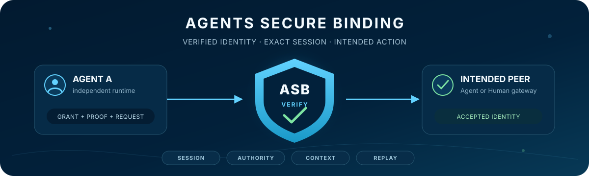

<h1 align="center">Agents Secure Binding</h1>

<p align="center"><strong>Verified interaction for independently operated AI Agents.</strong></p>

<p align="center">
  <a href="https://github.com/ToppyMicroServices/agents-secure-binding/actions/workflows/main.yaml"></a>
  <a href="https://github.com/ToppyMicroServices/agents-secure-binding/actions/workflows/security-red-team.yaml"></a>
  <a href="https://github.com/ToppyMicroServices/agents-secure-binding/releases/tag/v2.0.0-rc.2"></a>
  
  <a href="LICENSE"></a>
</p>

<p align="center">
  
</p>

<p align="center">
  <a href="#why-asb">Why ASB</a> ·
  <a href="#quick-start">Quick start</a> ·
  <a href="#components-and-status">Status</a> ·
  <a href="#security-contract">Security contract</a> ·
  <a href="#agent-to-human-participation">Agent to Human</a> ·
  <a href="#documentation">Documentation</a>
</p>

Agents Secure Binding (ASB) helps a service check which Agent is making a
request, what it is allowed to do, and whether its proof belongs to this exact
request and connection. It provides the verification layer; applications
remain responsible for their own approval rules and effects.

> The LLM is a content generator, not the security principal. ASB authenticates
> the runtime that acted and the authority it exercised; model output cannot
> grant itself permission.

## Quick start

Install [Go 1.26.6](https://go.dev/doc/install) and run these commands from this source checkout. The local app
below is a **current-branch experimental preview**, not part of `v2.0.0-rc.2`.
The first run downloads Go dependencies and compiles the app; later runs reuse
the build cache. No TEE device, LLM account, Node.js, Docker, or separate
SQLite installation is needed.

### Check that it works

```text
go run ./cmd/asb-human self-test
```

The self-test submits, approves, and declines proposals over real authenticated
loopback connections, then checks saved results after reopening the database.
It prints a final `PASS` line or exits with an error. It simulates the Human
reviewer, uses temporary state, and removes that state when it finishes. No
browser interaction is needed. This tests local software behavior, not hardware
assurance or a person's identity.

### Make the decision yourself

```text
go run ./cmd/asb-human demo --data-dir ./.asb-human
```

Open the private login link printed in the terminal. A separate Agent process
proposes changing the app's own `maintenance_mode` setting. Review the before
and after values in the browser, then approve or decline:

- Approval shows 「適用済み」 in the browser (`APPLIED` in the Agent result)
  and saves the new setting.
- Decline shows 「拒否済み」 (`DENIED`) and leaves the setting unchanged.

The Agent prints the result. Press Ctrl+C to stop the service; the decision,
setting, and recovery receipts remain in `.asb-human`. The browser UI is shared
across the macOS, Linux, and Windows builds; check the [runtime CI results](https://github.com/ToppyMicroServices/agents-secure-binding/actions/workflows/human-approval.yaml)
for the commit you use. This is a one-host, one-user
preview, not a general TaskCoord production service. `demo` chooses free ports
automatically; always use the link from the current run.

See the [local approval guide](docs/local-human-approval.md) for building a
reusable executable, troubleshooting, separate processes, and restart recovery.
For protocol-only examples, see [other local demonstrations](#other-local-demonstrations).

## Why ASB

Valid cryptography is not enough when it is valid for the wrong context. ASB
is designed to reject **context diversion**: material borrowed from another
service, tenant, Agent, task, delegation, action, or connection.

| Input that may look valid | ASB decision boundary |
| --- | --- |
| A valid grant presented by the wrong key holder | Bind the proof to the grant and authenticated Actor |
| A proof copied to another TLS connection | Bind it to the live TLS exporter or equivalent channel value |
| A valid identity used for a different task or action | Compare the exact canonical request with local policy |
| Valid but stale evidence or a repeated request | Enforce freshness and commit one-shot replay state |
| A hardware quote replayed on another session | Require the selected profile to bind evidence to that session |

ASB does not ask an Agent to declare what should be trusted. Expected service,
workload, task, authority, and attestation policy come from verifier-controlled
configuration.

Acceptance binds the authority grant, holder-of-key proof, accepted TLS
session, exact request, replay state, and any required attestation facts to
that local policy.

## Components and status

| Surface | Current status | Boundary |
| --- | --- | --- |
| Direct-Agent v1 verifier | **Supported release:** [`v1.1.1`](https://github.com/ToppyMicroServices/agents-secure-binding/releases/tag/v1.1.1) | Stable v1 product line and compatibility policy |
| ASB v2 Go module | **Prerelease:** [`v2.0.0-rc.2`](https://github.com/ToppyMicroServices/agents-secure-binding/releases/tag/v2.0.0-rc.2) | Breaking module migration and platform-neutral evidence boundary |
| macOS local lab | **Debug only** | Loopback, signed simulated evidence, no confidential execution |
| Direct SNP module | **Experimental:** `v0.1.1` | Separate appraiser module; live qualification incomplete |
| Direct TDX module | **Experimental:** `v0.1.2` | Separate appraiser module; strict-collateral success fixture and live qualification incomplete |
| Cocos adapter | **Experimental:** `v0.1.1` | Optional, independently versioned integration; not in the ASB root dependency graph |
| Agent ↔ Human TaskCoord | **Experimental, current branch / next prerelease candidate** | Human Participant, gateway Actor, bounded TLS ingress, and a Redis/Valkey store candidate; live backend qualification incomplete |
| Agent → Human relay | **Experimental, current branch / next prerelease candidate** | One active reachability grant queues one opaque relay intent; local gateway only, no real delivery provider |
| Task–Action lifecycle | **Experimental, current branch / next prerelease candidate** | Separate responsibility and execution state machines; reference store only for the Action binding |
| Local Human approval app | **Experimental, current branch** | Browser inbox, real software-only ASB/mTLS, and SQLite-backed local setting changes; one trusted host and user |
| Least-privilege execution | **Experimental, current branch** | Finite optimization, ASB-bound prior mandates, durable single-host admission, and a limited S3 executor; live AWS qualification pending |

`v2.0.0-rc.2` does not include the current-branch Human Coordination
surfaces; they are candidates for a later prerelease. No production-readiness
claim is made for those candidates or for SNP, TDX, and Cocos.

### Cocos boundary

Cocos is separated at the **Go module and release boundary**, not at the
repository boundary.

```text
ASB root module  github.com/ToppyMicroServices/agents-secure-binding/v2
  └─ no dependency on Cocos, SNP, or TDX nested modules

integrations/cocos  (independent go.mod, tag, tests, and release gate)
  ├─ ASB v2.0.0-rc.2
  ├─ SNP v0.1.1
  └─ TDX v0.1.2
```

The adapter remains in this repository and in the shared development
`go.work`, but it builds and releases with `GOWORK=off` and published module
versions. It translates Cocos runtime evidence into ASB interfaces; it is not
part of ASB Core. See the [attestation module boundary](docs/attestation-module-boundary.md)
and [Cocos integration guide](integrations/cocos/README.md).

## Other local demonstrations

<details>
<summary>Agent-to-Agent: one software-only TLS exchange</summary>

```sh
go run ./examples/a2a
```

The demo creates ephemeral keys and certificates, opens a mutually
authenticated TLS 1.3 connection, derives a live TLS exporter, and sends one
grant- and session-bound task. It also demonstrates rejection of scope
escalation, wrong audience, wrong session, and replay.

</details>

<details>
<summary>Agent-to-Agent: macOS debug lab and optional local models</summary>

```sh
make mac-debug-a2a
```

This runs the eight-scenario A2A security lab through loopback-only role
endpoints. It retains mTLS, exact session/request binding, signed
attestation-result verification, and replay handling, but the evidence is
explicitly labeled `SIMULATED`.

To connect two local OpenAI-compatible model endpoints:

```sh
make a2a-test
./build/asb-a2a-test --debug-simple \
  --workflow llm-conversation \
  --prompt-file ./prompt.txt \
  --agent-a-llm-url http://127.0.0.1:11434 \
  --agent-a-llm-model model-a \
  --agent-b-llm-url http://127.0.0.1:11434 \
  --agent-b-llm-model model-b
```

Both endpoints must use a loopback hostname. Proxy use and addresses resolving
outside loopback are rejected. Do not use production credentials or data.

The debug lab collects no SNP, TDX, TPM, or vTPM evidence. It is useful for
protocol debugging on a MacBook; it is not hardware qualification. See the
[multiprocess guide](examples/a2a-multiprocess/README.md) for reports, Docker,
multi-process roles, and the experimental two-model workflow.

</details>

<details>
<summary>Human Coordination: deterministic in-process protocol scenario</summary>

```sh
make mac-human-coordination-e2e
jq . build/human-coordination-e2e/evidence.json
```

This deterministic `debug-simple` scenario connects two logical local Agents,
one Human Participant, and a distinct Human gateway Actor through the real
TaskCoord, relay, and Action lifecycle packages. It uses in-process reference
stores and signed simulated evidence, with no network, live TLS, hardware
attestation, or delivery provider. The report always records
`production_claim = false`. See the
[Human Coordination E2E guide](examples/human-coordination-e2e/README.md).

</details>

## Security contract

The verifier evaluates one ordered contract:

1. Authenticate the authority grant and its policy scope.
2. Verify holder-of-key proof over the exact grant and accepted session.
3. Check freshness, nonce, validity, and replay state.
4. Bind any required attestation result to the same session.
5. Compare canonical observed values with verifier-local expected policy.
6. Commit replay state before returning the accepted identity. Applications
   that perform non-idempotent work must also reserve their stable operation.

The core implementation is centered on:

- [`pkg/atls/identitypolicy`](pkg/atls/identitypolicy): ordered identity,
  session, policy, and replay acceptance;
- [`pkg/clients`](pkg/clients): accepted-session client paths and bindings;
- [`pkg/production`](pkg/production): fail-closed attested and software-only
  compositions; and
- [`pkg/operationjournal`](pkg/operationjournal): durable application-operation
  reservation and state.

The repository SSOT uses D0–D6 for the stable v1 acceptance dimensions. The
experimental draft-06-inspired A2A v2 profile separates target selection and
effective authorization as D6 and D7. Tracking a draft does not by itself make
the implementation conformant. See [`docs/SSOT.md`](docs/SSOT.md) and the
[experimental v2 profile](docs/draft06-a2a-profile.md).

## Agent-to-Human participation

There is no package or product literally named `agent2human`. The v2
coordination surface is **Human TaskCoord**, with `pkg/humanrelay` as a
separate application layer:

```text
Human Participant  ≠  Human-facing gateway Actor
        │                         │
        └─ bounded responsibility └─ authenticated operation over TLS 1.3
                                  │
                                  v
                         ASB-bound TaskCoord ingress
```

The current v2 tree provides:

- distinct `HUMAN`, `AGENT`, and `AUTOMATED_SERVICE` Participants;
- assignment offer, acceptance, delegation provenance, release, revocation,
  fulfillment, and dependency checks;
- append-only questions, responses, corrections, and withdrawals;
- consent-scoped, relay-only Human matching and reachability records;
- an mTLS/TLS 1.3 ingress that binds gateway-asserted-for-human offers,
  transitions, delegations, and interaction appends to the exact grant,
  gateway proof, request, nonce, session, and replay decision;
- a Redis/Valkey `TaskCoord` store candidate with atomic assignment,
  delegation, interaction, and transactional-outbox commits; and
- a separate Task–Action lifecycle binding that preserves the distinction
  between accountable responsibility and durable execution state.

The implemented Human ingress assurance is
`gateway-asserted-for-human`: ASB verifies the gateway Actor's grant,
holder-of-key proof, session, and exact request, then attributes the operation
to the Human Participant under trusted registry and application policy. It is
not authenticated-Human evidence or a Human-held-key signature. It does not
prove Human liveness, Human-facing UI confirmation, or legal consent. The
[Human request binding profile](docs/asb-taskcoord-human-request-binding-v1.md#21-human-assurance-vocabulary)
defines the full vocabulary and non-guarantees.

The Human TaskCoord HTTP endpoints are `challenge` and
`execute`; their existing success responses remain `201` and `200`. Every
response has a server-generated `X-Request-ID`. Public errors keep the string
`error` field and add `code`, `retryable`, and `request_id`, while internal
details are redacted. `429` uses `Retry-After: 1`; an unknown execute outcome
must be reconciled rather than retried automatically. Relay and Action HTTP
endpoints are not implemented. See the
[HTTP response contract](docs/asb-taskcoord-human-ingress-demo.md#http-response-contract).

Agent-initiated contact is a separate, narrower relay:

```text
active AGENT + exact ASB-bound relay request
                    │
                    v
       active HumanReachabilityGrant
                    │  one grant = one intent
                    v
          opaque Human gateway session
                    │  revocation-aware internal Worker only
                    v
 QUEUED / DISPATCHING / PROVIDER_ACKNOWLEDGED / CANCELED
```

The relay never returns a Human ID, candidate ID, consent ID, direct contact,
or relay-session reference to the Agent. `PROVIDER_ACKNOWLEDGED` means only
that the configured gateway accepted the dispatch request. Human read,
acceptance, decline, and task completion remain separate authenticated
TaskCoord operations. Reachability consent authorizes scoped contact metadata,
not the exact message content; a separate Human-produced binding to the relay
`RequestDigest` would be required for exact-content approval and is not
implemented. A revocation that wins before dispatch produces `CANCELED`
without a provider call. Once `DISPATCHING` is durable, an unknown provider
outcome is not retried blindly. `LocalGatewaySink` is an in-memory Mac/CI test
surface; it does not send Email, SNS messages, or telephone calls.

This is a repository-level experimental implementation, not a complete Human
interaction product. The Redis/Valkey adapter has been exercised against a
stateful TLS protocol test double, not a live Redis or Valkey deployment or a
failover topology. The Action binding and Agent relay still use in-process
reference stores. The local approval app has its own browser UI and SQLite
outcome journal; it does not provide those features for generic TaskCoord or
relay operations. That broader coordination surface still lacks an end-user
UI, contact vault, Email/SNS/TEL provider, general matching network, relay
challenge/execute endpoint, outbox publisher, cross-proof Human-ingress outcome
journal, and production-qualified deployment.

Agent-authored TaskCoord operations, non-initial Action mutations, and
consent/grant administration currently accept verifier-created internal
projections but do not have complete external ASB profiles. Initial Action
acceptance and Human matching have the same trusted-internal boundary. The
debug E2E records every exercised boundary and evidence source in its JSON;
untrusted network, RPC, queue, or plugin input must not construct those
projections directly.

Start with the [Task Participant model](docs/task-participant-v1.md), the
[request-binding profile](docs/asb-taskcoord-human-request-binding-v1.md), and
the [TLS ingress demo](docs/asb-taskcoord-human-ingress-demo.md). The
[Agent-to-Human relay profile](docs/agent-to-human-relay-v1.md) and
[Task–Action lifecycle binding](docs/task-action-lifecycle-v1.md) describe the
two separate application layers. Stable Core, TaskAction, relay, HTTP, and
production requirement IDs—and their English/Japanese implementation
mapping—are in the
[Human Coordination conformance registry](docs/human-coordination-conformance-v1.md).
For a one-command Mac/CI walkthrough, run `make mac-human-coordination-e2e` and
read the [debug-simple evidence boundary](examples/human-coordination-e2e/README.md).

## Repository map

| Area | Path | Role |
| --- | --- | --- |
| Core acceptance | `pkg/atls`, `pkg/clients`, `pkg/production` | Identity, session, exact context, replay, and deployment compositions |
| Coordination | `pkg/taskcoord` | Human/Agent Participants, assignments, interactions, reachability, and bounded gateway-asserted-for-human ingress |
| Agent-to-Human relay | `pkg/humanrelay` | Exact ASB relay profile, privacy-minimized intent, and local Mac/CI gateway |
| Task execution | `pkg/actionlifecycle`, `pkg/taskcoord/actionbinding` | Durable Action state model and explicit Assignment binding |
| Shared TaskCoord store | `pkg/production/redis_taskcoord.go` | Redis/Valkey atomic state and transactional outbox candidate |
| Local approval app | `cmd/asb-human`, `internal/humanapp` | Portable CLI, browser inbox, and SQLite-backed local setting changes |
| Platform modules | `modules/attestation/snp`, `modules/attestation/tdx` | Independently versioned experimental hardware appraisers |
| Optional integration | `integrations/cocos` | Cocos evidence adapter outside the root module graph |
| A2A lab | `examples/a2a-multiprocess` | Runnable security scenarios and report schema |
| Human Coordination lab | `examples/human-coordination-e2e` | Deterministic in-process Mac/CI scenario with self-limiting evidence |
| Interoperability evidence | `interop/draft06-v2` | Independent Python verification of fixed v2 fixtures |
| Formal evidence | `formal` | ProVerif/TLA+ models and implementation mapping |

## Verification

Core and Human TaskCoord checks:

```sh
make human-coordination-gate
make mac-human-coordination-e2e
make product-security-gate
```

Standalone module and integration gates:

```sh
GOWORK=off make check-attestation-release
GOWORK=off make check-cocos-release
```

These commands validate software behavior and dependency boundaries. They do
not replace live SNP/TDX qualification. Some tests open loopback listeners and
may need a less restricted environment.

## Documentation

| Question | Start here |
| --- | --- |
| How can I try an Agent request and approve it myself? | [Local approval guide](docs/local-human-approval.md) · [Local validation record](docs/local-human-approval-validation.md) |
| Can a delegated action run automatically with verified minimum permissions? | [Finite model and demo](docs/least-privilege-v1.md) · [Authenticated execution](docs/least-privilege-execution.md) · [Portable proofs](docs/least-privilege-certificates.md) |
| What behavior is authoritative in this repository? | [SSOT](docs/SSOT.md) |
| What attacks and trust boundaries are in scope? | [Threat model](docs/threat-model.md) |
| Which v1 APIs and deployment choices are supported? | [API compatibility](docs/API_COMPATIBILITY.md) · [Production profile](docs/production-deployment-profile.md) |
| How are hardware providers kept outside ASB Core? | [Attestation module boundary](docs/attestation-module-boundary.md) |
| How does the A2A security lab work? | [Test-kit candidate](docs/a2a-security-testkit-v1.md) · [Multiprocess guide](examples/a2a-multiprocess/README.md) |
| What is implemented for Human participation? | [Task Participant v1](docs/task-participant-v1.md) · [Human ingress demo](docs/asb-taskcoord-human-ingress-demo.md) · [Agent-to-Human relay](docs/agent-to-human-relay-v1.md) · [Mac/CI E2E](examples/human-coordination-e2e/README.md) |
| Which Human Coordination requirements are implemented or still unqualified? | [Bilingual conformance registry](docs/human-coordination-conformance-v1.md) · [Production qualification boundary](docs/human-coordination-production-v1.md) |
| Which Human Coordination topics may need an Internet interoperability contract? | [IETF review note](docs/human-coordination-ietf-review.md) |
| How are Tasks connected to durable Actions? | [Action lifecycle](docs/action-lifecycle-v1.md) · [Task–Action binding](docs/task-action-lifecycle-v1.md) · [Request transcript](docs/action-transcript-v1.md) |
| What has been tested and what remains unverified? | [Live red-team report](docs/live-red-team-report.md) · [`PUBLICATION_TODO.md`](PUBLICATION_TODO.md) |
| How do the formal models map to code? | [`formal/MODEL_MAP.md`](formal/MODEL_MAP.md) |

## Scope and provenance

ASB is a non-normative implementation and evidence repository for the stable
Direct-Agent v1 profile and experimental candidate/v2 profiles. It is not an
IETF consensus document, complete application protocol, identity provider,
attestation evidence format, control plane, or production Human-facing service.

TLS 1.3, certificate validation, exporter computation, and key-schedule
security remain responsibilities of the deployment TLS stack. Hardware
evidence formats, collateral, and appraisal policy remain responsibilities of
the selected platform profile. CI and signed simulated evidence do not prove
hardware assurance.

The repository contains runtime, attestation, legacy `pkg/atls`, manager,
Agent, HAL, proxy, OCI, and helper code derived from
[`ultravioletrs/cocos`](https://github.com/ultravioletrs/cocos), together with
ASB-specific profiles, tests, vectors, and security helpers. The Apache-2.0
license and upstream notices are retained in [`ATTRIBUTION.md`](ATTRIBUTION.md).

## Security and license

Report suspected vulnerabilities through GitHub private vulnerability
reporting. Do not open a public issue containing exploit details. See
[`SECURITY.md`](SECURITY.md).

Maintained by ToppyMicroServices OÜ and licensed under
[`Apache-2.0`](LICENSE).
