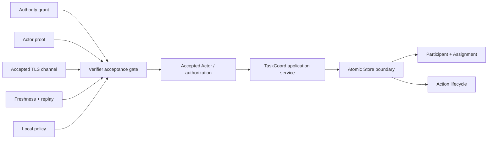

<div align="center">

# Agents Secure Binding

### Accept the right actor, on the right channel, for the right action.

Verifier-side identity and authorization binding for agent systems.

[](https://github.com/thinksyncs/agents-secure-binding/actions/workflows/main.yaml)
[](https://github.com/thinksyncs/agents-secure-binding/actions/workflows/security-red-team.yaml)
[](https://github.com/thinksyncs/agents-secure-binding/releases)
[](LICENSE)

[Try it](#try-it) · [Surfaces](#implementation-surfaces) ·
[Security](#security-contract) · [Docs](#start-here)

</div>

> [!IMPORTANT]
> ASB is an acceptance boundary, not a new cryptographic protocol. A valid
> credential is accepted only when its authority, actor, live channel, exact
> operation, freshness, replay state, and verifier-local policy agree.

## Why ASB

A signature can be valid for the wrong service, Agent, task, tool, or request.
ASB addresses that context-diversion gap.

```text
accepted result
  = verified authority
  + holder-of-key proof
  + accepted channel instance
  + exact request context
  + freshness and replay acceptance
  + verifier-local policy
```

ASB returns a typed, verifier-created acceptance result. Applications should
not reconstruct trusted identity or authorization from raw peer claims.

## Try it

Human TaskCoord over live mutual TLS 1.3:

```sh
go test -run '^TestHumanTaskCoordIngressDemo$' -v ./pkg/taskcoord/asbbinding
```

Human or Agent responsibility linked to a durable Action lifecycle:

```sh
go test -run '^TestServiceRunsHumanTaskActionLifecycle$' -v \
  ./pkg/taskcoord/actionbinding
```

The first demo terminates TLS itself, derives the exporter from that connection,
verifies an exact operation binding, commits replay state, and applies
TaskCoord CAS. The second keeps Assignment responsibility separate from Action
execution while exercising dependency WAIT/RESUME and atomic Store commits.

## Architecture



A real Human is a `HUMAN` Participant, not a searchable Agent. A gateway can
act as the authenticated Actor on that Human's behalf. Contact details remain
in a deployment-owned encrypted relay outside TaskCoord.

## Implementation surfaces

| Surface | Maturity | Purpose |
| --- | --- | --- |
| Direct-Agent v1 | Supported | Exact identity, channel, context, policy, and replay binding |
| `pkg/production` | Supported in v1.1.x | Attested and software-only verifier compositions with shared replay |
| Human TaskCoord ingress | Experimental | TLS-terminating Human gateway operations, Assignment CAS, immutable interactions |
| Task–Action lifecycle | Experimental | WAITING, PAUSED, leases, takeover, reconciliation, dependency waits, deadlock projection |
| A2A/AGTP discovery profiles | Experimental | Bounded interoperability and discovery experiments |
| Formal models and red-team harnesses | Evidence | Model and executable checks with documented limits |

Supported API commitments are defined in
[API compatibility](docs/API_COMPATIBILITY.md). Experimental packages do not
become supported merely by appearing in this repository.

## Security contract

The verifier fails closed unless all selected profile inputs agree. In
particular:

- expected audience, service, Agent, task, target, and authorization come from
  verifier policy;
- the peer key and exporter come from the accepted channel;
- decision-sensitive request fields are canonical and exactly bound;
- freshness and one-shot replay state are committed before acceptance;
- optional attestation is authenticated and evaluated by the selected profile;
- callers cannot submit trusted TLS values or current Task/Action snapshots as
  ordinary request fields.

Task and Action lifecycles remain distinct:

- Action `SUCCEEDED` makes an accepted Assignment eligible for a separate
  `FULFILL`; it does not fulfill it automatically;
- Assignment release or revocation does not invent an Action cancellation;
- `WAITING != INDETERMINATE`, `ORPHANED != FAILED`, and timeout is not
  automatically failure;
- only a validated dependency wait is projected into deadlock detection.
  Timers, signals, manual work, and reconciliation remain external escape paths.

## Production boundary

The Direct-Agent production profile includes role-separated trust,
certificate-verified TLS, bounded token lifetimes, and fail-closed shared replay.
Deployment choices are documented in the
[production profile](docs/production-deployment-profile.md).

TaskCoord and Task–Action remain experimental. Before claiming production
durability, connect their Store contracts to one transactional database,
provide an outbox where notifications are required, and qualify backup,
failover, retention, and recovery. Human contact delivery additionally requires
an encrypted relay, consent enforcement, abuse controls, and deletion policy.

The included Memory stores are concurrency-safe reference adapters. They
exercise CAS, deduplication, multi-record atomicity, and TOCTOU rejection but do
not survive restart.

## Start here

| Goal | Document or package |
| --- | --- |
| Understand ASB | [Internet-Draft](https://datatracker.ietf.org/doc/draft-okutomi-session-bound-agent-identity/) · [repository SSOT](docs/SSOT.md) |
| Integrate the verifier | [`pkg/clients`](pkg/clients) · [`pkg/atls/identitypolicy`](pkg/atls/identitypolicy) |
| Deploy Direct-Agent v1 | [`pkg/production`](pkg/production) · [deployment profile](docs/production-deployment-profile.md) |
| Model Human responsibility | [Task Participant specification](docs/task-participant-v1.md) |
| Run Human TLS ingress | [demo guide](docs/asb-taskcoord-human-ingress-demo.md) · [`pkg/taskcoord/asbbinding`](pkg/taskcoord/asbbinding) |
| Integrate long-running Actions | [Task–Action specification](docs/task-action-lifecycle-v1.md) · [`pkg/taskcoord/actionbinding`](pkg/taskcoord/actionbinding) |
| Review attacks and evidence | [threat model](docs/threat-model.md) · [live red-team report](docs/live-red-team-report.md) |

The Internet-Draft is an active individual submission, not an IETF consensus
document. Repository implementation and test evidence do not establish complete
conformance to every binding profile or deployment.

## Verification

Focused checks for the supported verifier and experimental coordination layers:

```sh
go test -race -count=1 ./pkg/atls/identitypolicy ./pkg/clients ./pkg/production
go test -race -count=1 ./pkg/taskcoord/... ./pkg/actionlifecycle ./schemas
```

The broader security gate is:

```sh
make product-security-gate
```

See [SECURITY.md](SECURITY.md) for private vulnerability reporting and
[CONTRIBUTING.md](CONTRIBUTING.md) for contributions.

Apache-2.0 licensed. See [LICENSE](LICENSE).
