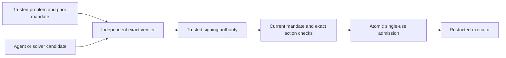

# Bounded least-privilege authorization

Status: experimental local implementation; not a released cloud IAM integration.

ASB can select the lowest-cost effective permission set for an explicit finite
problem, independently recheck a proposed optimum, and issue a signed, short-lived
capability for an action allowed by a prior mandate. A requesting agent can call
the JSON CLI or submit a `Solution` to the Go API. No LLM API is called by this
implementation.

An optimal solution does not create permission to perform an action. The trusted
mandate fixes the actor, task, exact action digest, complete problem digest,
validity window, and whether automatic execution is allowed. An unset or false
`AllowAutomatic` returns `ErrHumanRequired`, including for a valid optimum.

## Run it

From the repository root, using Go 1.26 or later:

```sh
GOWORK=off go run ./cmd/asb-leastprivilege demo

GOWORK=off go run ./cmd/asb-leastprivilege solve \
  --problem examples/leastprivilege/problem.json > /tmp/asb-lp-solution.json

GOWORK=off go run ./cmd/asb-leastprivilege verify \
  --problem examples/leastprivilege/problem.json \
  --solution /tmp/asb-lp-solution.json
```

The demo selects the reader grant, signs a capability, admits one local read,
and checks that replay, a different resource, and a mandate requiring human
approval are rejected. Its output includes the candidate, capability, public key,
and mandate. The demo key is ephemeral; the signing key is never printed.

The example file's optimum is `report-reader`, with effective permission
`reports.read` and cost 1. Its implication models a combination of role assumption
and write access that also confers secret access. Such a combination falls outside
the example's allowed permissions.

`solve` and `verify` accept `--max-evaluations` and `--timeout` (default 5 seconds).
An incomplete search exits nonzero without a solution or successful verification
record. The CLI rejects unknown fields, duplicate object keys, trailing JSON,
inputs above 1 MiB, and nesting beyond 32 levels. Keep the trusted problem outside
the requesting agent's write authority. The candidate file can be untrusted.

## What the optimizer guarantees

The model contains up to 20 selectable grants, 256 permission atoms, 256
implication rules and 256 forbidden combinations. Permission and grant IDs are
bounded exact identifiers. They have no built-in AWS, GCP, wildcard or path
semantics. Each permission has a positive integer cost; the total must fit a
`uint64`.

For a grant subset, evaluation:

1. Takes the union of the selected grants' permissions.
2. Applies implication rules until no more permissions are added. A rule fires
   when all its antecedents are present; an empty antecedent always fires.
3. Checks required permissions, the allowed upper bound and forbidden combinations.
4. Sums costs over distinct effective permissions, including implied permissions.

Required permissions may be empty. An empty allowed set permits no permissions.
Duplicate and unknown references are rejected. Canonical problem digests cover
the full model, including costs and constraints, and do not depend on collection
ordering or the distinction between nil and empty sets.

`Solve` exhaustively traverses the grant subsets. `Verify` recomputes the supplied
candidate and independently enumerates subsets to reject any cheaper feasible
choice. It does not call `Solve`. A budget of `1 << len(problem.Grants)` permits
each search to complete, subject to its context deadline. Equal-cost optima are
accepted; the objective does not minimize the number of grant bundles.

This establishes a global minimum over the declared candidate space and cost
function. It does not establish that the task specification is correct, that a
workflow completes, or that undeclared cloud policies and privilege-escalation
paths cannot exist. The solver and checker share a model evaluator; the candidate
is rechecked by enumeration, not accompanied by an externally checkable formal
proof certificate. Tests also compare results with a separate map-based oracle.

## Authorization and execution



`NewAuthorizer` snapshots the trusted problem, mandate and Ed25519 signing key.
`Authorize` snapshots the candidate before verification and rechecks time after
the search. Successful verification can produce a capability only when the
mandate explicitly allows automatic execution. Capability TTL is bounded by both
the mandate expiry and `MaxTTLSeconds` (1 through 3600 in this profile).

`CheckCapability` verifies the signature against a locally trusted public key and
compares the capability with the **current** mandate and authenticated request.
Changing the current mandate invalidates the older capability's mandate digest.
An authorizer holding an old snapshot can still sign; an executor using current
policy rejects it. Applications must fetch current policy from a trusted source
and coordinate policy updates with their execution boundary.

`DigestAction` binds operation, resource and exact argument bytes. Re-encoding
JSON arguments may change the digest. This package does not authenticate the
request's `ActorID` or `TaskID`: applications construct these from verified ASB
context, never from unchecked peer labels. These capabilities are application
authorization evidence, not ASB Identity Grants or session-binding proofs.

`ConsumeCapability` checks the capability and atomically consumes its mandate.
All capabilities issued for the same mandate share that single use, including
reissued capabilities. Mandate IDs must be unique across the deployment's use
store, including across signing-key rotation. `CheckCapability` alone does not
enforce single use.

`MemoryUseStore` is a bounded reference store. It never evicts a live record,
rejects requests when capacity is exhausted, and prevents a backward wall-clock
jump from reviving a record already pruned after expiry. Concurrent timestamps
may arrive out of order while their records are still live.

The supplied store loses history on restart. Consumption and an external effect
are not an atomic transaction: a crash can consume authority without completing
the operation. Durable storage, effect reconciliation, and a restricted executor
that actually enforces the selected permissions are deployment responsibilities.
No cloud credentials are created or restricted here, and IAM provider semantics
are not parsed or simulated.

## TaskCoord integration

[`pkg/taskcoord/leastprivilegebinding`](../pkg/taskcoord/leastprivilegebinding/)
implements an additive binding profile. Its parent authority digest is the full
problem digest without the `sha256:` prefix, matching TaskCoord's bare-hex format.
`EffectiveAuthorityDigest` identifies the child permission set within that model.
These conventions apply to this new profile; arbitrary existing authority
digests cannot be reinterpreted as least-privilege models.

Build the mandate's action using `leastprivilegebinding.Action(Delegation)`. After
issuing a capability, use `leastprivilegebinding.Delegate` with actual parent/child
state and a freshly authenticated TaskCoord operation. It checks task and actor
bindings, calls the existing state machine, and consumes the mandate only after
the transition is valid. The caller then commits it using `Store.CommitDelegation`.
The tested path preserves the accepted parent and creates an offered child.

The lower-level `Verify` returns `taskcoord.VerifiedDelegation`. That projection
does not carry task or actor IDs, so callers using it directly must preserve the
exact verified bindings. Prefer the `Delegate` wrapper. Neither API manufactures
Human approval evidence or changes the Human ingress path. A commit failure after
consumption still needs reconciliation; the adapter does not provide a durable
transaction spanning both stores.

Relevant checks:

```sh
GOWORK=off go test -race -count=1 \
  ./pkg/leastprivilege ./pkg/taskcoord \
  ./pkg/taskcoord/leastprivilegebinding ./cmd/asb-leastprivilege
GOWORK=off go vet ./pkg/leastprivilege \
  ./pkg/taskcoord/leastprivilegebinding ./cmd/asb-leastprivilege
```

The dedicated workflow runs these checks on Linux and macOS when pushed. Local
test results do not establish cloud IAM equivalence, production durability, or a
completed remote CI run.
